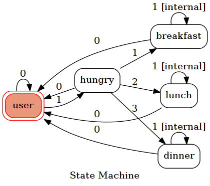

# 成大美食機器人GT

他是美食機器人GT

為甚麼是成大, 因為我只有幾個成大周邊的資料

資料寫在app.py裡

## Fsm

基本上是用0 1 2 3來做transition, 因為打中文很麻煩(對使用者..)

## 試用一下

只要跟著機器人指示走就好, 傳0 1 2 3

如果想知道當前state, 可以傳 now 
###### (注意大小寫!)

如果想要fsm的圖片, 可以傳 showfsm 
###### (注意大小寫!)

